## 网站活动追踪实现全流程

---

### 第一步：前端埋点（数据采集）

用户的每个行为，前端通过 **埋点 SDK** 捕获并上报：

```javascript
// 前端埋点代码示例
// 用户点击商品
document.getElementById('product').addEventListener('click', () => {
  tracker.send({
    event: 'click',
    userId: 'user_123',
    productId: 'prod_456',
    timestamp: Date.now(),
    page: '/home'
  })
})

// 页面浏览
window.addEventListener('load', () => {
  tracker.send({
    event: 'page_view',
    userId: 'user_123',
    url: location.href,
    referrer: document.referrer,
    timestamp: Date.now()
  })
})
```

---

### 第二步：数据收集服务（Producer）

前端上报到一个**收集服务**，由它写入 Kafka：

```
前端浏览器
    │  HTTP POST /track
    ↓
收集服务（Node.js / Java）
    │  Kafka Producer
    ↓
Kafka Broker
```

```java
// 收集服务将行为写入对应 Topic
ProducerRecord<String, String> record = new ProducerRecord<>(
    "page-view",      // Topic 名称
    "user_123",       // Key（按用户分区，保证同一用户有序）
    eventJson         // Value（事件JSON）
);
producer.send(record);
```

---

### 第三步：Kafka 存储分发

```
                    Kafka
┌──────────────────────────────────┐
│  Topic: page-view   [0][1][2]    │  ← 3个分区
│  Topic: search      [0][1]       │  ← 2个分区
│  Topic: purchase    [0][1][2]    │
│  Topic: click       [0]          │
└──────────────────────────────────┘
```

**Key 用 userId 的好处：** 同一用户的行为始终写入同一分区，保证**顺序性**，分析用户路径时不会乱序。

---

### 第四步：多个消费者并行消费

```
Kafka
  │
  ├──→ 【实时推荐系统】
  │       消费 search + click
  │       用户搜索"手机" → 3秒内推送手机相关商品
  │
  ├──→ 【实时风控系统】
  │       消费 purchase + auth
  │       同一账号1分钟内下单10次 → 触发风控拦截
  │
  ├──→ 【实时监控大屏】
  │       消费所有 Topic
  │       统计当前在线人数、热门页面、转化率
  │
  └──→ 【离线数仓（Hadoop/Hive）】
          每小时批量拉取
          次日生成用户行为分析报表
```

---

### 一条数据的完整生命周期

```
用户点击商品
    ↓ 50ms
前端埋点捕获 → HTTP上报收集服务
    ↓ 10ms
收集服务写入 Kafka Topic: click
    ↓
┌───────────────────────────────┐
│  推荐系统消费  → 实时更新推荐列表  │  ← 100ms内
│  监控系统消费  → 更新点击率统计   │  ← 200ms内
│  数仓消费     → 存入 Hive 表    │  ← 1小时批次
└───────────────────────────────┘
```

用图来解释：完整流程如下：


**浏览器 → app.py（有）**
用户点击商品，前端 JS 发 `POST /track` 给 Flask，Flask 用 Kafka Producer 把事件写入对应 Topic。

**浏览器 → consumer.py（没有）**
浏览器**不会**直接调用 consumer.py。consumer.py 是一个独立的后台进程，它持续监听 Kafka，有新消息自动触发。

**获取推荐的路径**
浏览器发 `GET /recommendations` 给 app.py，app.py 返回推荐结果。推荐数据是 consumer.py 消费消息后统计出来的。

**演示版 vs 生产版的区别：**

| | 演示版（当前） | 生产版 |
|---|---|---|
| 统计数据存哪 | app.py 内存 | Redis / 数据库 |
| consumer.py 的作用 | 打日志 | 写 Redis |
| 多进程是否共享数据 | 是（同一进程） | 通过外部存储共享 |

---

### 关键设计要点

| 设计 | 原因 |
|------|------|
| **用 userId 做 Key** | 同用户行为写同一分区，保证顺序 |
| **每类行为独立 Topic** | 消费者按需订阅，互不干扰 |
| **收集服务异步写入** | 不阻塞用户请求，上报失败也不影响体验 |
| **数据保留 7 天** | 消费者故障恢复后可以重放历史数据 |